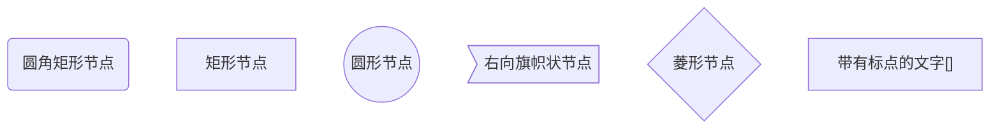
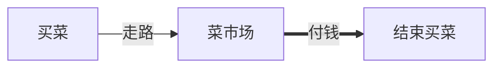
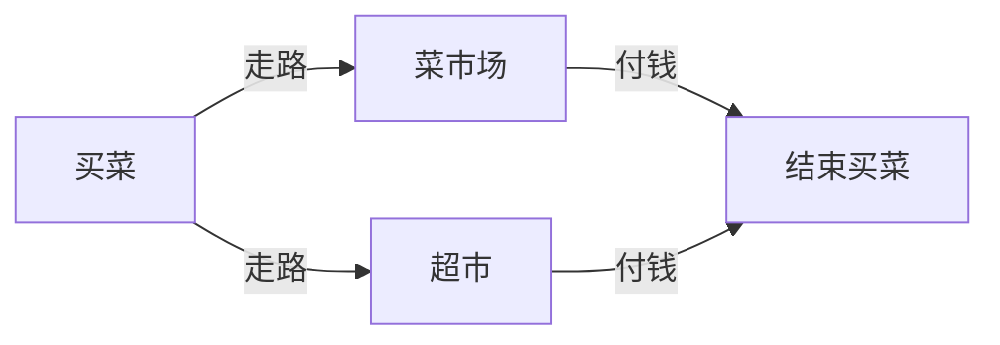
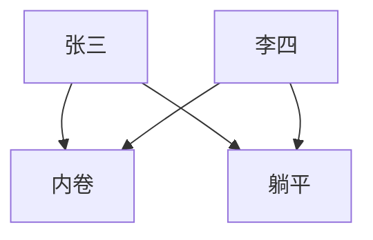
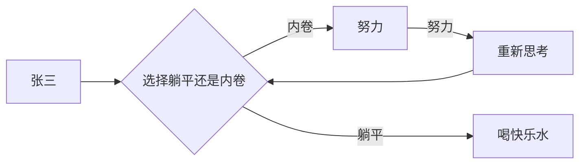
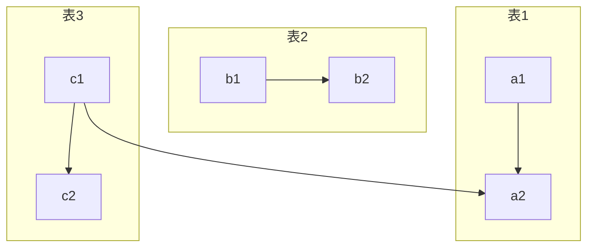
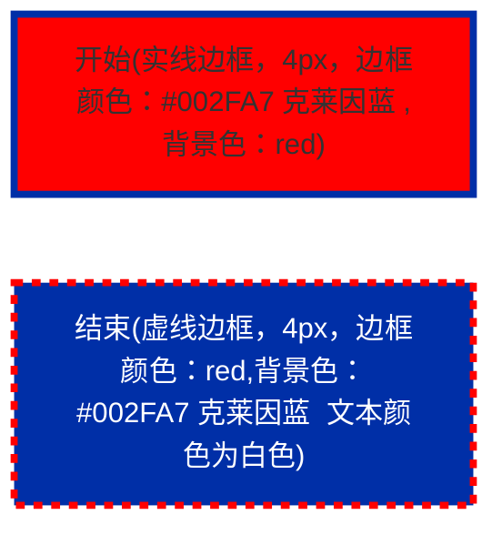
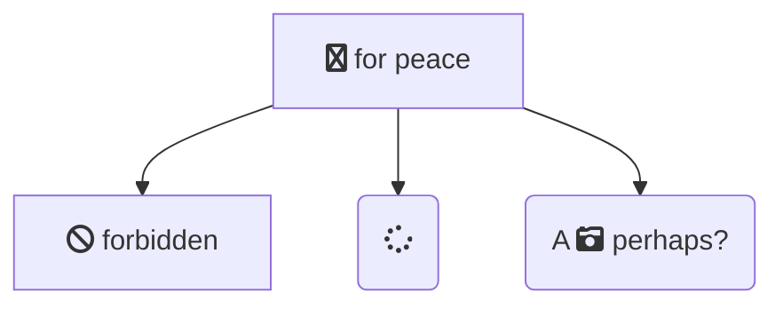
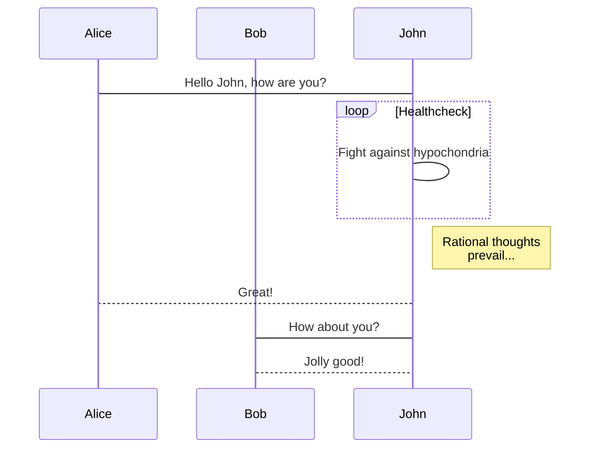

## 图表方向

```bash
graph TB # 	从上到下
graph BT # 	从下到上
graph RL # 	从右到左
graph LR # 	从左到右
```

## 📔 节点定义

- `id[文字]` 矩形节点
- `id(文字)` 圆角矩形节点
- `id((文字))` 圆形节点
- `id>文字]` 右向旗帜状节点
- `id{文字}` 菱形节点

```
graph
  a(圆角矩形节点)
  b[矩形节点]
  c((圆形节点))
  d>右向旗帜状节点]
  e{菱形节点}
  f["带有标点的文字[]"]
```



1. 圆角矩形 表示“开始”与“结束”
2. 矩形表示行动方案、普通工作环节用
3. 菱形表示问题判断或判定（审核/审批/评审）环节
4. 用平行四边形表示输入输出
5. 箭头代表工作流方向

## 节点间连线

- `>` 添加尾部箭头
- `-` 不添加尾部箭头
- `--` 单线
- `--text--` 单线上加文字
- `==` 粗线
- `==text==` 粗线加文字
- `-.-` 虚线
- `-.text.-` 虚线加文字

### 单行

```
graph LR
  s[买菜] --走路--> P[菜市场] ==付钱==> e[结束买菜]
```



### 多行

```
graph LR
  s[买菜] --走路-->P[菜市场]--付钱--> e[结束买菜]
  s--走路--> o[永辉超市]--付钱--> e
```



### 交叉

```
graph
  z[张三] & L[李四]-->C[内卷] & D[躺平]
```



## 连接长度

- `--->` 链接线会增加 1 个层级的长度, `---->` 链接线会增加 3 个层级

| 增加层级长度   | 1    | 2     | 3      |
| -------------- | ---- | ----- | ------ |
| 实线           | ---  | ----  | -----  |
| 带箭头的实线   | -->  | --->  | ---->  |
| 粗实线         | ===  | ====  | =====  |
| 带箭头的粗实线 | ==>  | ===>  | ====>  |
| 虚线           | -.-  | -..-  | -...-  |
| 带箭头的虚线   | -.-> | -..-> | -...-> |

```
graph LR
  z[张三]-->X{选择躺平还是内卷}
  x--内卷-->Y[努力]
  Y--努力-->R[重新思考]
  R-->X
  X--躺平--->N[喝快乐水]

```



## 子图
```
graph TB
  c1-->a2
  subgraph 表1
  a1-->a2
  end
  subgraph 表2
  b1-->b2
  end
  subgraph 表3
  c1-->c2
  end
```




## 注释

```
%% 注释内容
```

## 样式

```
graph LR
  s["开始(实线边框，4px，边框颜色：#002FA7 克莱因蓝,背景色：red)"]
  e["结束(虚线边框，4px，边框颜色：red,背景色：#002FA7 克莱因蓝  文本颜色为白色)"]
  style s  fill:red ,stroke:#002FA7,stroke-width:4px
  style e  fill:#002FA7,stroke:red,stroke-width:4px,stroke-dasharray: 5 5,color:#fff
```



- 使用class 生成样式

```
s[开始]:::ownstyle-->e[结束]
    classDef ownstyle fill:#002FA7,stroke:red,stroke-width:4px,stroke-dasharray: 5 5,color:#fff
```


## 图标

可以使用 Font Awesome 图标。语法 fa:icon class name。

```
graph TD
   B["fa:fa-twitter for peace"]
   B-->C[fa:fa-ban forbidden]
   B-->D(fa:fa-spinner);
   B-->E(A fa:fa-camera-retro perhaps?);
```



## 时序图

```
sequenceDiagram
    participant Alice
    participant Bob
    Alice->John: Hello John, how are you?
    loop Healthcheck
        John->John: Fight against hypochondria
    end
    Note right of John: Rational thoughts <br/>prevail...
    John-->Alice: Great!
    John->Bob: How about you?
    Bob-->John: Jolly good!
```


